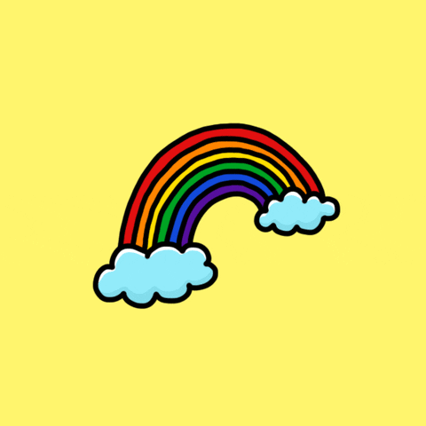

### 	:pirate_flag: :crossed_flags: :checkered_flag:

-:green_square: I'm a software engineering student

-:orange_square: I'm a front end web devopler

-:blue_square: I'm a tech enthusiast

-:peace_symbol: bonus: also i love to sketch ugly things

-:pirate_flag: Blazing fast learning

#### ❯MMM — There’s something very satisfying about creating things ;⏎

  <a href="https://github.com/MalonzaMcCarthy">
  
  

 
  
  
  
  
  
  
  
  
  
  

## Languages and Frameworks
-:euro: javascript, python , rust

-:money_with_wings: html5, css3, tailwind css

-:dollar: Nextjs, Vue,

-:coin: Nodejs, experss

-:credit_card: MongoDB, Postgresql

## :telephone_receiver: me

-:biohazard: https://twitter.com/MalonzaMccarthy

-:basecamp:  https://github.com/MalonzaMcCarthy

-:sparkle:  ######

-:email:  malonzamccarthy@gmail.com

<!--  -->

 
 

